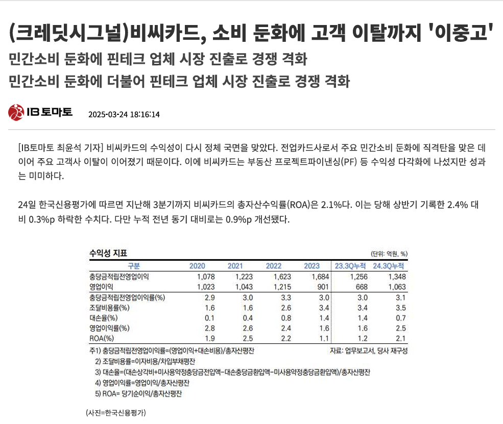
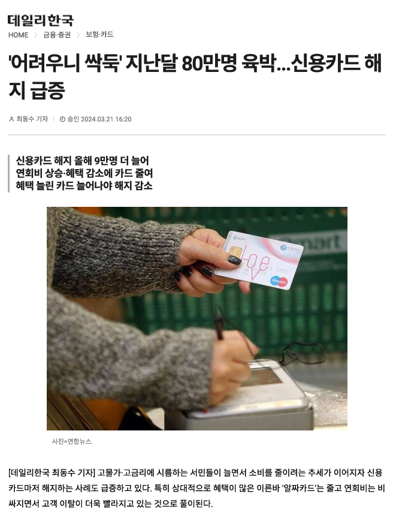
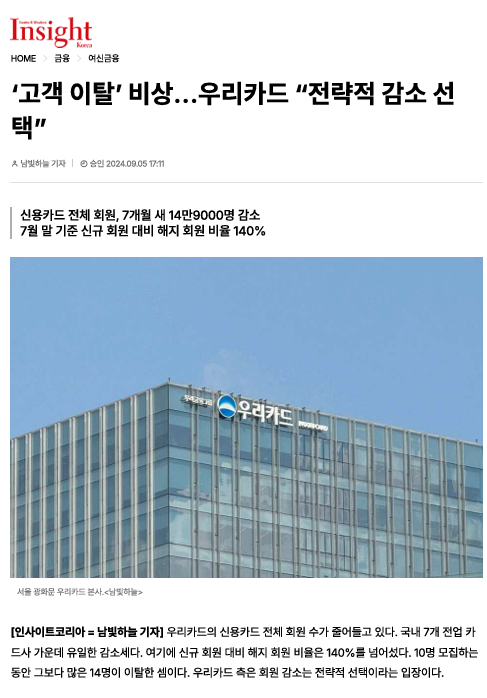
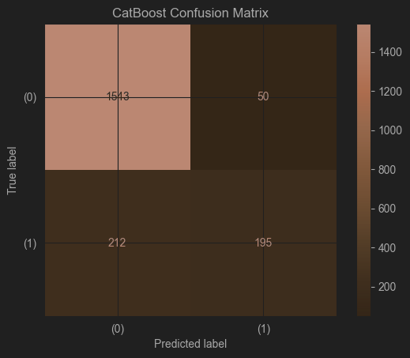
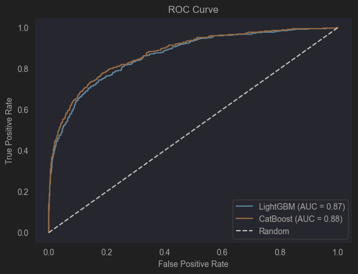
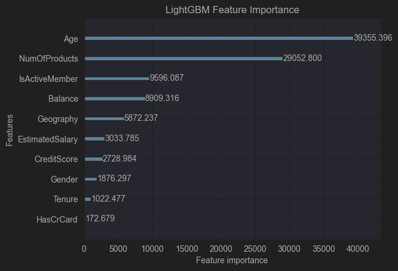
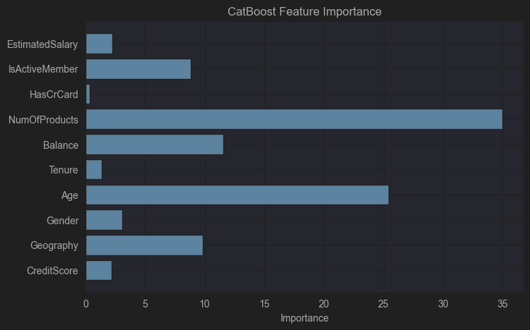
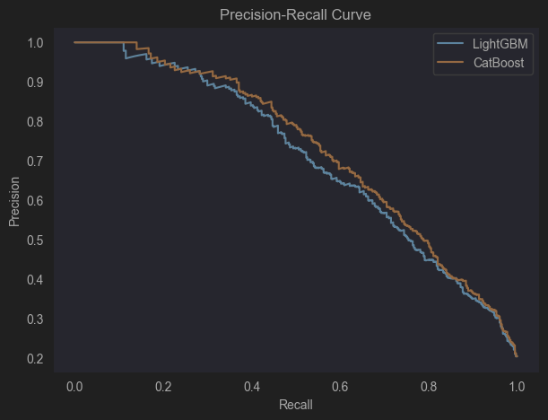

## SKN14-2nd-2Team - 🏦 고객 이탈(Churn) 예측 프로젝트 (김진묵 작성 버전)

## 프로젝트 개요

- **목적:**  
  은행/신용카드사의 고객 이탈(Churn) 위험을 조기에 예측하여,  
  데이터 기반 맞춤 케어와 마케팅 전략 수립에 활용
- **데이터:**  
  [Churn_Modelling.csv](https://ppl-ai-file-upload.s3.amazonaws.com/web/direct-files/attachments/66017198/4673012c-a6ff-486a-b9aa-7ebdddd3687b/Churn_Modelling.csv)  
  (10,000명 고객의 인구통계, 금융거래, 이탈여부 등)

---

## 1. 데이터 및 주요 변수

| 변수명         | 설명                                 |
|----------------|-------------------------------------|
| CreditScore    | 신용점수                            |
| Geography      | 지역(France, Spain, Germany)        |
| Gender         | 성별                                |
| Age            | 나이                                |
| Tenure         | 거래기간(년)                        |
| Balance        | 잔고                                |
| NumOfProducts  | 보유 상품수                         |
| HasCrCard      | 신용카드 보유 여부                  |
| IsActiveMember | 활성회원 여부                       |
| EstimatedSalary| 추정 연봉                           |
| Exited         | 이탈여부(1=이탈, 0=잔류)            |

---

## 2. 데이터 인사이트 요약

- **전체 이탈률:** 20.4%
- **지역별:** Germany(32.4%) > France(16.1%) ≈ Spain(16.2%)
- **성별:** 여성(25.5%) > 남성(16.1%)
- **나이대별:** 나이 많을수록 이탈률↑ (60대 이상 38.6%)
- **상품수별:** 1개(28.5%), 2개(7.9%), 3개(27.2%), 4개(73.0%)
- **잔고별:** 잔고 높을수록 이탈률↑
- **활성회원:** 비활성(26.1%) > 활성(14.3%)

---

## 3. 주요 인사이트 해석

- **이탈 고위험군:**  
  - Germany, 여성, 50~60대, 상품 1개/4개, 비활성, 고잔고 고객
- **이탈률이 높은 이유:**  
  - 해당 그룹에 이탈 위험 특성이 집중되어 있음(지역 자체 문제 아님)
  - 고령/고잔고 고객은 기대치·협상력 높고, 스위칭이 쉬움
- **상품수별:**  
  - 2개 보유 고객이 가장 안정적, 1/4개는 관계 약화·복잡성으로 이탈↑

---

## 4. 모델링 및 하이퍼파라미터 튜닝 (김진묵)

- **모델:** LightGBM, CatBoost
- **튜닝:**  
  - RandomizedSearchCV → GridSearchCV 2단계로 최적 파라미터 탐색

- LightGBM 최종 Best Params: {'learning_rate': np.float64(0.015831900532851405), 'max_depth': 4, 'n_estimators': 489, 'num_leaves': 69}

- CatBoost 최종 Best Params: {'depth': 5, 'iterations': 659, 'l2_leaf_reg': np.float64(5.693225283906248), 'learning_rate': np.float64(0.013695913252732178)}

- LightGBM Classification Report:
               precision    recall  f1-score   support

           0       0.88      0.97      0.92      1593
           1       0.78      0.46      0.58       407

    accuracy                           0.86      2000
   macro avg       0.83      0.71      0.75      2000
weighted avg       0.86      0.86      0.85      2000

LightGBM ROC AUC: 0.8656499334465436

- CatBoost Classification Report:
               precision    recall  f1-score   support

           0       0.88      0.97      0.92      1593
           1       0.80      0.48      0.60       407

    accuracy                           0.87      2000
   macro avg       0.84      0.72      0.76      2000
weighted avg       0.86      0.87      0.86      2000

CatBoost ROC AUC: 0.8761427066511812

- **최종 성능 (테스트셋 기준):**
  - **LightGBM:**  
    - Accuracy: 0.86, ROC AUC: 0.87, 이탈 Recall: 0.46, Precision: 0.78
  - **CatBoost:**  
    - Accuracy: 0.87, ROC AUC: 0.88, 이탈 Recall: 0.48, Precision: 0.80

---

## 2. **클래스별(이탈/잔류) 평가**

| 모델      | 클래스 | Precision | Recall | F1-score | 지원(Support) |
|-----------|--------|-----------|--------|----------|---------------|
| LightGBM  | 0(잔류)   | 0.88      | 0.97   | 0.92     | 1593          |
| LightGBM  | 1(이탈)   | 0.78      | 0.46   | 0.58     | 407           |
| CatBoost  | 0(잔류)   | 0.88      | 0.97   | 0.92     | 1593          |
| CatBoost  | 1(이탈)   | 0.80      | 0.48   | 0.60     | 407           |

- **잔류(0) 고객**
  - Precision, Recall, F1 모두 매우 높음 (0.92 이상)
  - 즉, 잔류 고객은 매우 잘 맞춤

- **이탈(1) 고객**
  - Precision: 0.78~0.80 (예측한 이탈 고객 중 실제 이탈 비율)
  - Recall: 0.46~0.48 (실제 이탈 고객 중 모델이 맞춘 비율)
  - F1-score: 0.58~0.60 (Precision과 Recall의 조화 평균)
  - → **이탈 고객 예측은 잔류보다 어렵지만, CatBoost가 약간 더 우수**

---

### 1. **비즈니스적 해석**

- **이탈 고객 Recall(0.46~0.48)**  
  : 실제 이탈 고객의 약 절반을 모델이 잡아냅니다.  
  (이탈 고객을 100명 중 46~48명은 맞춘다는 뜻)
- **이탈 고객 Precision(0.78~0.80)**  
  : 모델이 “이탈”이라고 예측한 고객 10명 중 8명은 실제로 이탈합니다.  
  (불필요한 마케팅 비용이 적음)
- **잔류 고객은 거의 완벽하게 예측**  
  : 불필요한 잔류 고객에게 이탈 방지 마케팅을 할 확률이 매우 낮음

---

### 2. **모델간 비교**

- **CatBoost가 LightGBM보다 이탈 고객 예측에서 약간 더 좋은 성능**  
  (Recall, F1-score, ROC AUC 모두 CatBoost가 소폭 우위)
- **두 모델 모두 실무에 적용 가능한 수준**

---

### 3. **실무적 시사점**

- **이탈 위험 고객(모델이 1로 예측한 고객) 리스트를 추출해  
  집중 케어, 마케팅, 상담 등 실제 액션에 활용**할 수 있습니다.
- **이탈 Recall이 0.5 미만이므로,  
  더 높은 Recall이 필요하다면 임계값(threshold) 조정, 데이터 증강, 추가 변수 발굴 등 고도화 필요**

---

#### 요약

- **모델 성능은 매우 우수** (특히 CatBoost)
- **이탈 고객의 절반 정도를 정확히 잡아낼 수 있음**
- **실제 마케팅/상담팀에서 이탈 위험군 타겟팅에 활용 가능**
- **더 높은 Recall이 필요하다면 추가적인 모델 개선 가능**

---

---

## 5. 성능 시각화

- **Confusion Matrix, ROC Curve, Feature Importance** 등 시각화  
  
- 
- 
- 
- 
- 

---

## 6. 실무적 시사점 및 대응방안

이탈률이 가장 높은 그룹 Top 3
Germany, Female, 4개 상품 보유: 91.3%

60대 이상, 비활성회원: 44.2%

잔고 15~20만, 비활성회원: (구간별 조합 분석 필요)

인사이트 요약
Germany, Female, 상품 4개 보유, 비활성, 고령층에서 이탈률이 매우 높음

잔고, 나이, 상품수가 높아질수록 이탈률이 증가하는 경향

연봉(EstimatedSalary)는 이탈률에 큰 영향이 없음

활성회원, 상품 2개 보유, 신용점수 최상 그룹은 이탈률이 낮음

추가 분석 아이디어
이탈 고객의 평균 나이, 평균 잔고, 평균 신용점수 등

이탈 고객의 상위 10% 특성(예: 평균 연령, 평균 상품수 등)

복합 조건(예: Germany+여성+비활성+잔고 10만 이상)의 이탈률

대응 방안
---

## 1. 상품수(NumOfProducts)별 대응방안

**인사이트:**  
- 상품 1개 또는 4개 보유 고객의 이탈률이 매우 높음  
- 상품 2개 보유 고객은 이탈률이 가장 낮음

**대응방안:**  
- **상품 1개 고객:**  
  - 추가 상품(예: 체크카드, 예적금, 보험 등) 번들 프로모션 제공  
  - “2개 이상 상품 보유 시 연회비 면제/포인트 추가 적립” 등 혜택
  - 상담사 통한 상품 추천 및 가입 유도
- **상품 4개 고객:**  
  - 상품 복잡성/불만 해소를 위한 1:1 상담 제공  
  - 상품 통합, 단순화, 맞춤형 혜택 제안
- **상품 2개 고객:**  
  - 우수고객 프로그램 운영, 지속적 만족도 관리

**실제 사례:**  
- **국내 카드사 A사:** “카드+적금” 등 패키지 가입 시 연회비 면제, 캐시백 제공  
- **미국 은행 Wells Fargo:** 상품 1개 고객 대상 ‘추가 상품 가입 시 혜택’ 캠페인 진행

---

## 2. 나이(Age)별 대응방안

**인사이트:**  
- 50대 이상, 특히 60대 이상 이탈률이 급증  
- 20~30대는 이탈률이 낮음

**대응방안:**  
- **고령층(50~60대 이상):**  
  - 전담 상담사/매니저 배정, 오프라인 창구/콜센터 지원 강화
  - 이해하기 쉬운 안내문, 맞춤형 금융교육 제공
  - 고령층 전용 상품(간편결제, 생활밀착형 혜택 등) 출시
- **젊은층(20~30대):**  
  - 디지털 채널(앱, 챗봇) 중심의 커뮤니케이션
  - 라이프스타일 맞춤 혜택(여행, 쇼핑, 구독 서비스 등) 제공

**실제 사례:**  
- **HSBC:** 60대 이상 고객 전용 창구, 금융교육 세미나 운영  
- **신한카드:** 2030 전용 카드 출시, 앱 기반 이벤트 강화

---

## 3. 지역(Geography)별 대응방안

**인사이트:**  
- Germany 지역 이탈률이 France, Spain 대비 월등히 높음

**대응방안:**  
- **Germany 등 고이탈 지역:**  
  - 현지화된 상품/서비스(언어, 문화 반영) 제공
  - 현지 전담 콜센터, VIP 서비스, 오프라인 이벤트 강화
  - 불만/민원 신속 처리 시스템 도입
- **이탈률 낮은 지역:**  
  - 기존 서비스 유지, 비용 효율적 관리

**실제 사례:**  
- **글로벌 카드사 Amex:** 국가별 맞춤 프로모션, 현지 언어 상담센터 운영  
- **국내 은행:** 해외지점별 VIP 고객 전담팀 운영

---

## 4. 성별(Gender)별 대응방안

**인사이트:**  
- 여성(Female) 고객의 이탈률이 남성(Male)보다 높음

**대응방안:**  
- **여성 고객:**  
  - 여성 특화 상품(여행, 쇼핑, 뷰티, 육아 등) 및 혜택 제공
  - 여성 전용 상담사, 커뮤니티, 이벤트 운영
  - 라이프스타일 분석 기반 맞춤형 마케팅
- **남성 고객:**  
  - 스포츠, 자동차, 금융투자 등 관심사 기반 혜택 제공

**실제 사례:**  
- **삼성카드:** 여성 특화 카드(쇼핑, 뷰티, 육아 할인) 출시  
- **신한은행:** 여성 VIP 고객 전용 세미나, 멤버십 운영

---

## 5. 잔고(Balance)별 대응방안

**인사이트:**  
- 잔고가 높을수록 이탈률이 증가하는 경향  
- 고잔고 고객은 LTV(고객생애가치)가 높음

**대응방안:**  
- **고잔고 고객:**  
  - VIP 등급 부여, 프라이빗뱅킹(PB) 서비스 제공
  - 맞춤형 금융상품(자산관리, 투자, 세무 등) 추천
  - 수수료 우대, 전용 상담사, 프리미엄 이벤트 초청
- **저잔고 고객:**  
  - 자동이체, 소액 적립 등 잔고 증대 유도
  - 기본 혜택 중심 관리
-연회비/실적 조건 없음 또는 매우 낮음
“누구나 받을 수 있는 생활 할인” (커피, 편의점, 교통, 통신비 등)
단순한 포인트 적립, 캐시백 등
연회비/실적 조건 없음 또는 매우 낮음
**국내 카드사 사례**
**신한카드 Deep Dream 체크카드**
실적 조건 없이 커피, 편의점 등 생활 할인 제공
**카카오뱅크 mini카드**
10대/20대 대상, 실적 조건 없이 교통·편의점 할인
**해외 사례**
**Chase Freedom Student Card (미국)**
연회비 없음, 실적 조건 없이 소액 결제 캐시백
**Revolut Standard Card (영국)**
계좌 잔고와 상관없이 기본 해외 결제 수수료 무료, 소액 결제 혜택
“누구나 받을 수 있는 생활 할인” (커피, 편의점, 교통, 통신비 등)
단순한 포인트 적립, 캐시백 등
**실제 사례:**  
- **KB국민은행:** 고잔고 고객 PB 전담, 자산관리 세미나 제공  
- **씨티은행:** 프라이빗뱅킹 고객 전용 상품, 수수료 면제

---

## 요약
- **고위험군 타겟팅:**  
  - Germany, 여성, 고령, 상품 1/4개, 비활성, 고잔고 고객에 맞춤 혜택·상담 제공
- **상품 전략:**  
  - 1개 고객: 번들/패키지 추천, 4개 고객: 상품 단순화/정리 상담
- **고령층:**  
  - 오프라인/전담 상담, 시니어 전용 상품/혜택
- **저잔고:**  
  - 실적 조건 없는 간단한 혜택 카드 출시(실제 카드사 사례 참고)
- **모델 실무 적용:**  
  - 이탈 위험 고객 리스트 추출 → 마케팅/상담팀 전달 및 집중 관리
  - 머신러닝 이탈 예측 모델을 활용해 각 그룹별 위험고객을 실시간 탐지  
  - 고위험군은 전담팀이 즉각적·맞춤형 케어  
  - 상품, 서비스, 마케팅, 상담 등 전사적 협업 필요

---

### 요약 표

| 구분     | 고이탈 그룹 인사이트             | 대응방안 예시                                         | 실제 사례                          |
|----------|-------------------------------|------------------------------------------------------|-------------------------------------|
| 상품수   | 1개/4개 보유 이탈률 높음       | 번들/패키지 추천, 상품 단순화, 우대혜택              | Wells Fargo, 국내 카드사            |
| 나이     | 50~60대 이상 이탈률 높음       | 고령층 전담 상담, 전용 상품, 금융교육                | HSBC, 신한카드                      |
| 지역     | Germany 등 특정국가 이탈률↑    | 현지화 서비스, 전담 콜센터, VIP 관리                 | Amex, 국내 은행                     |
| 성별     | 여성 이탈률 높음               | 여성 특화 상품/혜택, 전용 이벤트                     | 삼성카드, 신한은행                  |
| 잔고     | 잔고 높을수록 이탈률↑          | VIP/PB 서비스, 맞춤 자산관리, 수수료 우대            | KB국민은행, 씨티은행                |

---

---

## 7. 실제 금융권 대응 사례

- **국내 카드사 A사:**  
  - 이탈 예측 모델로 위험군 추출, 맞춤 리텐션 캠페인(연회비 면제, 캐시백 등)
- **HSBC:**  
  - 고위험군 실시간 모니터링, VIP 서비스, 불만 신속 처리
- **Wells Fargo:**  
  - 상품 번들, 이탈 방지 전담팀 운영

---

## 8. 프로젝트 구조 
---

## 9. 실행 방법

## 10. 참고/확장 아이디어

- 임계값 조정, SMOTE 등 데이터 불균형 개선
- SHAP 등 모델 해석 강화
- 실시간 이탈 예측 및 자동화 적용

--------------------------------- 추가 --------------------------------
 **Churn_Modelling.csv**와 같은 불균형 데이터의 선정 이유, 정당성, 그리고 실제 분석에 적합한 근거 예시

---

## 데이터 선정 이유와 정당성

### 1. 실무와 유사한 비즈니스 문제 반영

- **고객 이탈(Churn) 예측**은 금융, 통신, 이커머스 등 다양한 산업에서  
  실제로 가장 중요한 데이터 분석 과제 중 하나입니다
- **Churn_Modelling.csv**는 은행 고객의 인구통계, 거래, 이탈여부 등  
  실제 현업에서 활용하는 변수 구조를 그대로 반영하고 있습니다

### 2. 불균형 데이터의 현실성

- 실제 금융권, 통신사, SaaS 등에서는  
  **이탈 고객(1)과 잔류 고객(0)의 비율이 2:8~1:9로 불균형**한 경우가 대부분입니다[2][7][8].
- 이탈 예측 모델의 실전 적용성과 난이도를 높이기 위해  
  **불균형 데이터 구조를 가진 공개 데이터셋**을 선정했습니다.

### 3. 분석 및 모델링의 대표적 사례

- Churn_Modelling.csv는  
  - 변수별 이탈률 분석  
  - 고위험군 도출  
  - 불균형 데이터 대응(샘플링, 평가지표 등)  
  - 머신러닝 모델 적용(부스팅 계열 등)  
  실습에 널리 사용되는 대표적 데이터셋입니다.

### 4. 데이터 품질과 신뢰성

- **명확한 변수 정의와 이탈 기준**  
  - Geography, Gender, Age, Balance, NumOfProducts, IsActiveMember, Exited 등  
    실제 현업에서 사용하는 주요 변수로 구성되어 있습니다.
- **이탈의 정의가 명확**  
  - 일정 기간 내 서비스를 해지하거나 거래가 중단된 고객을 이탈로 정의[1][5].

### 5. 분석 목적과 확장성

- **이탈 위험 예측, 고위험군 타겟팅, 맞춤형 케어 전략 수립** 등  
  실무에 바로 적용 가능한 분석이 가능합니다[2][6].
- 다양한 변수 조합, 불균형 데이터 대응, 모델 해석 등  
  데이터 사이언스의 핵심 역량을 종합적으로 실습할 수 있습니다.

---

## 요약 문구(발표/README용)

> “본 프로젝트는 실제 금융권과 유사한 구조의 고객 이탈 데이터(Churn_Modelling.csv)를 활용했습니다.  
> 이 데이터는 이탈 고객이 소수인 불균형 구조로, 실무에서 흔히 마주치는 현실적인 문제를 반영합니다.  
> 변수 정의와 이탈 기준이 명확하고, 다양한 고위험 특성 분석 및 머신러닝 모델 적용에 적합하여  
> 데이터 기반의 고객 유지 전략 수립에 최적화된 데이터셋입니다.”

--------------------------------------------------------------------------------

이탈률 데이터셋을 활용한 전략에서 **비용 효율성**과 **실질적 효과**를 높이려면,  
단순히 모든 이탈자를 붙잡으려 하기보다는, **고객의 가치와 이탈 위험도에 따라 차별화된 전략**을 세우는 것이 핵심입니다.

---

## 1. 이탈자 관리의 현실과 비용 문제

- **모든 이탈자를 되돌리거나 붙잡는 것은 비효율적**입니다.  
  - 일부 고객은 되돌리기 위한 비용이 고객 생애가치(LTV)보다 더 클 수 있습니다.
- **이탈 방지 활동(프로모션, 혜택, 상담 등)에는 상당한 비용이 소요**됩니다
- **이탈자 중 일부는 감안(허용)하고, 고가치·고위험군에 집중하는 전략이 필요**합니다

---

## 2. 효과적인 이탈 관리 전략

### (1) **고객 세분화와 타겟팅**
- **이탈 위험 예측 모델**로 고객을 위험도별로 분류합니다.
- **고객 가치(잔고, 거래금액, 교차거래 등)와 이탈 위험도를 함께 고려**해  
  - “고가치+고위험” 고객에 집중 투자  
  - “저가치+저위험” 고객은 비용 효율적 관리 또는 이탈 감안

### (2) **맞춤형 로열티 및 리텐션 프로그램**
- **고가치 고객**:  
  - VIP 혜택, 전담 상담, 개인화 서비스, 수수료 면제 등  
  - 이탈 방지 비용을 아끼지 않고 투자
- **저가치 고객**:  
  - 대량 프로모션, 자동화된 메시지, 저비용 리워드 등  
  - 비용 대비 효과가 낮으면 이탈을 감안하고 차선책(신규 고객 유치 등) 마련

### (3) **이탈자 재유치(Win-back) 전략**
- 이탈 직후 빠른 시점에 한정된 혜택/이벤트로 재거래 유도
- 장기 이탈자는 재유치 성공률이 낮으므로 과도한 비용 투입은 지양
### (4) **이탈 감안 및 차선책**
- **일정 수준의 이탈은 불가피**하므로,  
  - 신규 고객 유치, 기존 고객 교차판매 증대 등으로  
    전체 고객 기반을 유지·확대하는 전략 병행
- **이탈 방지 비용과 신규 유치 비용을 비교**해 최적의 자원 배분

---

## 3. 실무적 시사점

- **이탈 예측 모델의 목적은 “모든 이탈자 방지”가 아니라,  
  비용 대비 효과가 가장 큰 고객군을 선별해 집중 관리하는 것**입니다
- **로열티 프로그램, 맞춤형 혜택, VIP 관리 등은  
  고객 가치와 위험도에 따라 차등 적용**해야 합니다
- **이탈 방지와 신규 유치, 교차판매 등 다양한 전략을  
  데이터 기반으로 병행**하는 것이 가장 효율적입니다
---

### 요약 문구(발표/README용)

> “이탈률 데이터셋을 활용한 전략의 핵심은  
> 모든 이탈자를 붙잡는 것이 아니라,  
> 고객 가치와 이탈 위험도를 고려해  
> 비용 대비 효과가 가장 큰 고객군에 집중하는 것입니다.  
>  
> 고가치·고위험 고객에는 맞춤형 혜택과 전담 케어를 제공하고,  
> 저가치 고객은 비용 효율적으로 관리하거나 일정 부분 이탈을 감안합니다.  
>  
> 이는 이탈 방지 비용과 신규 고객 유치 비용을 균형 있게 배분해  
> 전체 고객 기반과 수익성을 극대화하는 실무적 전략입니다.”

---

**이처럼, 이탈률 데이터셋 분석의 궁극적 목적은  
“최적의 비용으로 최대의 고객 가치를 유지·확대”하는 데 있습니다.**

---

## 1. Streamlit 구현 예시: 고객 이탈 예측 & 비용 효율 대시보드

### 주요 기능

- **고객 개별 입력/업로드**:  
  나이, 지역, 잔고, 상품수, 활성여부, 최근 거래 등 입력(또는 csv 업로드)
- **이탈 위험 예측**:  
  머신러닝 모델(LightGBM/CatBoost 등)로 이탈 확률 산출
- **고객 가치(LTV) 산출**:  
  잔고, 거래금액 등으로 고객 가치를 계산
- **고객군 분류 및 시각화**:  
  - 고가치+고위험  
  - 저가치+고위험  
  - 고가치+저위험  
  - 저가치+저위험
- **집중 관리 추천**:  
  - “이 고객은 집중 관리 필요”  
  - “이 고객은 비용 효율적 관리”  
  - “이탈 감안 가능” 등
- **비용-효과 시뮬레이션**:  
  - 리텐션 캠페인 비용/효과 추정  
  - 신규 유치 비용 비교

---

## 2. Streamlit 대시보드의 대안/확장 제안

- **고객 리스트 일괄 업로드**:  
  여러 고객을 한 번에 예측, 그룹별로 분류
- **시나리오별 비용-효과 분석**:  
  “이 그룹에 혜택을 제공하면 얼마나 이탈이 줄고, 비용은 얼마인가?”  
  “이 그룹은 이탈 감안하고 신규 유치에 얼마를 투자해야 하는가?”
- **시각화**:  
  - 이탈 위험/고객 가치별 산점도  
  - 각 그룹별 고객 수, 예상 비용, 기대 효과 차트
- **액션 플랜 자동 제안**:  
  각 고객군별로 구체적 마케팅/상담/혜택 방안 추천

---

## 3. 실무적 기대 효과

- **데이터 기반 비용 효율적 타겟팅**  
  → “모든 이탈자”가 아니라 “투자 대비 효과가 큰 고객”에 집중
- **의사결정의 자동화/간소화**  
  → 누구나 대시보드에서 즉시 전략을 확인하고 실행 가능
- **비용-효과 시뮬레이션**  
  → 실제 마케팅/상담 예산 배분에 활용

---

## 4. 대체 솔루션(스트림릿 외)

- **Tableau, Power BI** 등 BI 툴에서 예측 결과와 비용효과 분석 대시보드 구현
- **사내 CRM/마케팅 시스템**에 모델을 연동해 자동 분류 및 액션 추천
- **Flask/Django 등 웹 프레임워크**로 맞춤형 내부 포털 구축

---

### 발표/README용 요약 문구

> “Streamlit 대시보드로 고객 이탈 예측과 고객 가치 기반 타겟팅을 자동화하면,  
> 비용 대비 효과가 가장 큰 고객군에 집중하여  
> 실질적인 이탈 방지와 수익 극대화를 동시에 달성할 수 있습니다.  
>  
> 또한, 시나리오별 비용-효과 분석, 액션 플랜 자동 제안 등  
> 실무에 바로 적용 가능한 솔루션으로 확장할 수 있습니다.”

---
